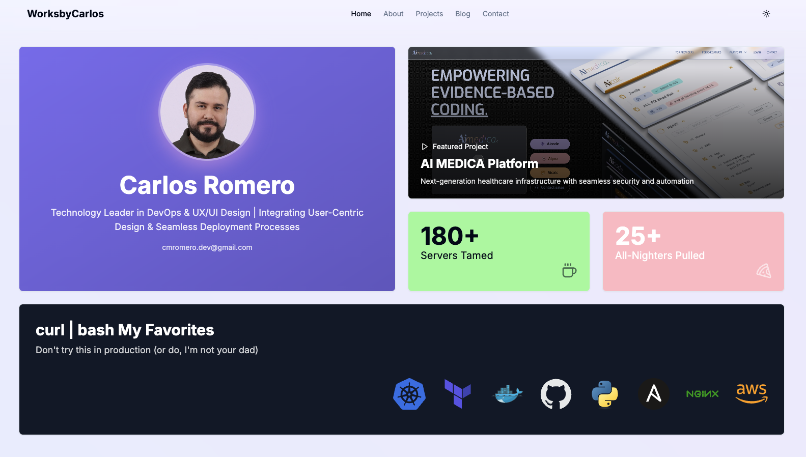

<div align="center">
  <h1>🚀 WorksbyCarlos</h1>
  <p>Engineering Tomorrow's Systems – Today</p>
  
  <p>
    <a href="https://worksbycarlos.com">View Demo</a>
    ·
    <a href="https://github.com/romerocm/worksbycarlos/issues">Report Bug</a>
    ·
    <a href="https://github.com/romerocm/worksbycarlos/issues">Request Feature</a>
  </p>

  
</div>

## ✨ Features

- 🎨 Modern UI/UX with Next.js 13 and Tailwind CSS
- 🌙 Dark/Light mode support
- 🎭 Framer Motion animations
- 📱 Fully responsive design
- 🚀 Server-side rendering
- 🎮 Interactive 3D elements with Three.js
- 🔄 Dynamic content loading
- 🎯 TypeScript for type safety

## 🛠️ Tech Stack

- **Framework:** Next.js 13
- **Styling:** Tailwind CSS
- **Animation:** Framer Motion
- **3D Graphics:** Three.js
- **UI Components:** shadcn/ui
- **Deployment:** Vercel
- **Version Control:** Git
- **Language:** TypeScript

## 🚀 Quick Start

1. Clone the repository:

```bash
git clone https://github.com/romerocm/worksbycarlos.git
```

2. Install dependencies:

```bash
cd worksbycarlos
npm install
```

3. Create a `.env` file:

```bash
cp .env.example .env.local
```

4. Start the development server:

```bash
npm run dev
```

5. Open [http://localhost:3000](http://localhost:3000) with your browser.

## 📁 Project Structure

```
worksbycarlos/
├── app/                   # Next.js 13 app directory
├── components/           # Reusable components
├── lib/                  # Utility functions
├── public/              # Static assets
├── styles/              # Global styles
└── types/               # TypeScript types
```

## 🎨 Color Reference

| Color     | Hex                                                              |
| --------- | ---------------------------------------------------------------- |
| Primary   |  #7B68EE |
| Secondary |  #5B4BC5 |
| Success   |  #98FB98 |
| Warning   |  #FFB6C1 |

## 🤝 Contributing

Contributions are always welcome! Please follow these steps:

1. Fork the repository
2. Create a new branch: `git checkout -b feature/amazing-feature`
3. Make your changes
4. Commit your changes: `git commit -m 'Add some amazing feature'`
5. Push to the branch: `git push origin feature/amazing-feature`
6. Open a pull request

## 📝 License

This project is licensed under the MIT License - see the [LICENSE](LICENSE) file for details.

## 👨‍💻 Author

**Carlos Romero**

- Website: [worksbycarlos.com](https://worksbycarlos.com)
- LinkedIn: [@romerocm](https://linkedin.com/in/romerocm)
- Email: cmromero.dev@gmail.com

## 💫 Acknowledgments

- [shadcn/ui](https://ui.shadcn.com/) for the beautiful UI components
- [Framer Motion](https://www.framer.com/motion/) for the smooth animations
- [Three.js](https://threejs.org/) for 3D graphics
- [Next.js](https://nextjs.org/) for the amazing framework

---

<div align="center">
  Made with ❤️ by Carlos Romero
</div>
